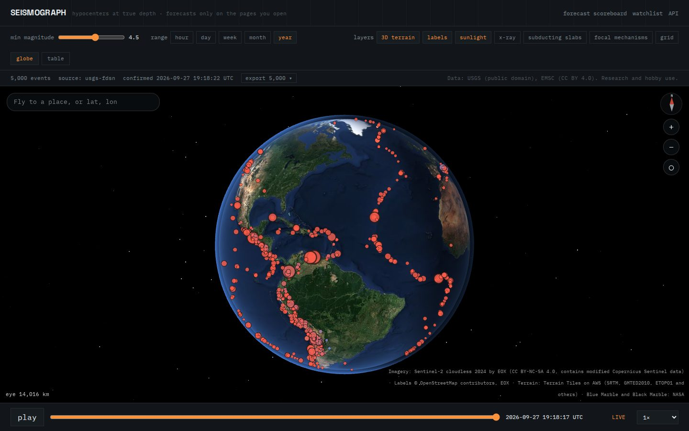
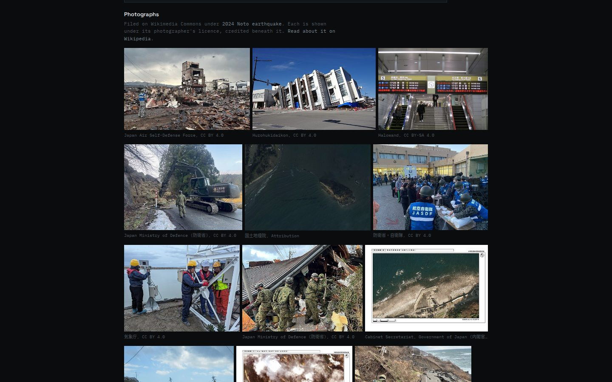
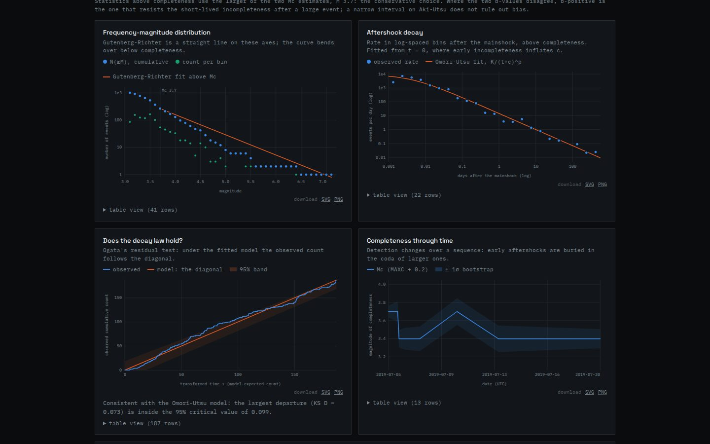
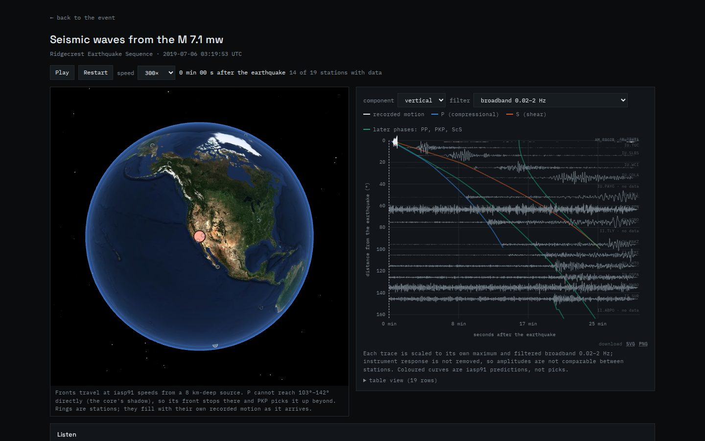
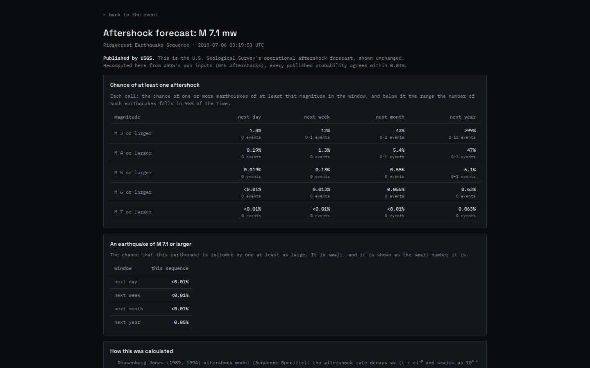
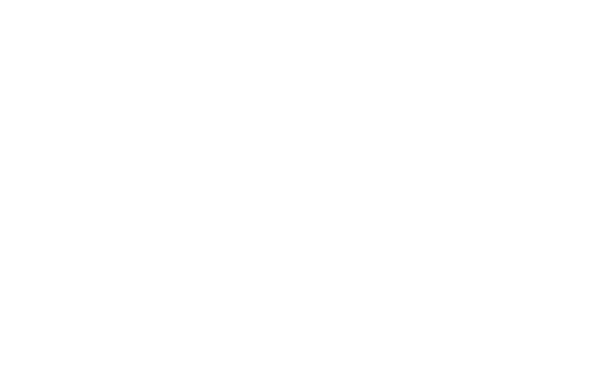

# Seismograph

A web application for monitoring, analysing and understanding earthquakes.

**Research and hobby use only.** No advertising, no subscriptions, no accounts, and no
running cost.



## What it does

- **A real Earth.** Sentinel-2 imagery streamed down to street level, 3D terrain, city lights on
  the night side, and a camera that moves like Google Earth. Every earthquake from the live USGS
  catalogue sits on it; x-ray mode drops each one to its **true depth** beneath the surface, and
  subducting slabs and focal mechanisms can be drawn in.
- **Time is the primary axis**, not a filter. One scrubber drives the whole view, and every state
  is a shareable URL that restores exactly.
- **Event pages** built on the full USGS product tree: every agency's solution with its
  uncertainties, moment tensor, ShakeMap, felt reports, PAGER exposure and ground failure. Each
  page opens with the earthquake explained in plain words, and takes questions about it.
- **Photographs** of notable earthquakes, from Wikimedia Commons, each credited to its
  photographer under its own licence.
- **Sequences.** Aftershocks gathered and analysed: b-values with their confidence intervals,
  Omori-Utsu decay with Ogata's residual test, completeness through time, and two declustering
  methods side by side so their disagreement shows.
- **Aftershock forecasts** for the whole world. Where USGS publishes one, it is shown and
  recomputed from USGS's own inputs; elsewhere the same model runs with USGS's generic
  parameters for the region.
- **A public scoreboard.** Every forecast is written to a hash-chained ledger before its window
  opens and scored after it closes, against the region's long-term rate. The misses are shown
  too. A GitHub Actions runner issues forecasts hourly and scores them daily.
- **Waves you can watch and hear.** Seismic phases cross the globe at iasp91 speeds while real
  recordings from stations worldwide play, as sound, on the same clock.
- **Comparison** with 32 well-studied sequences at the same elapsed time, and what followed in
  each.
- **Depth cross-sections** through the nearest subducting slab.
- **Export** as CSV, TSV, JSON, GeoJSON, QuakeML, KML/KMZ, XLSX or Parquet; every chart as SVG or
  PNG; an ObsPy snippet for the same query; and a keyless public API at `/api/v1`.
- **Watchlists** kept only in your browser, with no alerts: a quiet digest of what was recorded
  in the places you care about, set against what is usual there.

<table>
  <tr>
    <td width="50%"></td>
    <td width="50%"></td>
  </tr>
  <tr>
    <td>Photographs on the 2024 Noto earthquake's page</td>
    <td>The 2019 Ridgecrest sequence, analysed</td>
  </tr>
  <tr>
    <td></td>
    <td></td>
  </tr>
  <tr>
    <td>Waves from Ridgecrest crossing the planet</td>
    <td>The aftershock forecast, recomputed from USGS's inputs</td>
  </tr>
  <tr>
    <td colspan="2"></td>
  </tr>
  <tr>
    <td colspan="2">The scoreboard, which says so when the model does not beat the baseline</td>
  </tr>
</table>

## What it does not do

**It makes no forward-looking claim of any kind.** Deterministic earthquake prediction is not
scientifically possible, and no part of this application implies otherwise. Aftershock
forecasts are probabilities from published statistical models (Reasenberg-Jones, Omori-Utsu),
shown on pages you choose to open and never as an alert. An end-to-end test asserts that the
globe and event pages contain no forward-looking language.

## Running it

```bash
npm install
npm run dev
```

**No credentials are needed.** Every data source is public and keyless. The plain-words
explanations are written from a fixed template; a language-model key in `.env.local` (see
`.env.example`) is optional, only rewrites the template, and every rewrite is checked against
the numbers before it is shown.

```bash
npm test               # unit and component tests
npm run e2e            # browser tests (Playwright starts a dev server)
npm run typecheck      # tsc --noEmit, strict
npm run build
npm run ledger:issue   # issue forecasts for new M5+ earthquakes
npm run ledger:score   # score forecasts whose windows have closed
npm run ledger:verify  # check the ledger's hash chain
```

## Data sources and licences

| Source | Use | Licence |
|---|---|---|
| [USGS earthquake services](https://earthquake.usgs.gov/fdsnws/event/1/) | Catalogue, event products, aftershock forecasts | Public domain |
| [EMSC](https://www.emsc-csem.org/) | Normalization support | CC BY 4.0 |
| [EarthScope](https://service.earthscope.org/) and [Raspberry Shake](https://raspberryshake.org/) | Waveforms | Per each network's terms |
| [Global CMT](https://www.globalcmt.org/) | Focal mechanisms | Free to use, with citation |
| [Slab2](https://doi.org/10.5066/F7PV6JNV) | Subduction surfaces | Public domain |
| [Sentinel-2 cloudless by EOX](https://s2maps.eu) | Globe imagery | CC BY-NC-SA 4.0 |
| [Terrain Tiles on AWS](https://registry.opendata.aws/terrain-tiles/) | 3D terrain | Open data |
| [NASA GIBS](https://earthdata.nasa.gov/gibs) | Blue Marble, Black Marble | Public domain |
| [OpenStreetMap](https://www.openstreetmap.org/) via EOX and Nominatim | Labels, place search | ODbL |
| [Wikidata](https://www.wikidata.org/) and [Wikimedia Commons](https://commons.wikimedia.org/) | Photographs of notable earthquakes | CC0 (Wikidata); each photograph under its own licence, credited where shown |

Full details, including how each file in `public/data` was built, are in
`public/data/SOURCES.md`. The photographs in `docs/screenshots/event-photos.jpg` belong to the
photographers credited beneath them, under the licences named there.

## Architecture

Every read of the catalogue goes through `lib/repositories/`, so no component knows where events
come from. `lib/science/` holds every statistic as a pure function over plain data, each tested
against published values; the aftershock forecasts reproduce USGS's published numbers to within
0.2% in the unit suite. The forecast ledger is two append-only, SHA-256-chained JSON Lines files in
`ledger/`, committed to this repository.

## Documents

- `docs/design.md` — the design, and what each phase built and found.
- `docs/research-findings.md` — the evidence behind it.
- `spikes/FINDINGS.md` — what the Phase 0 spike week measured. Two of its findings are
  load-bearing: the globe never renders continuously, and `seisplotjs` never reaches the
  server.
